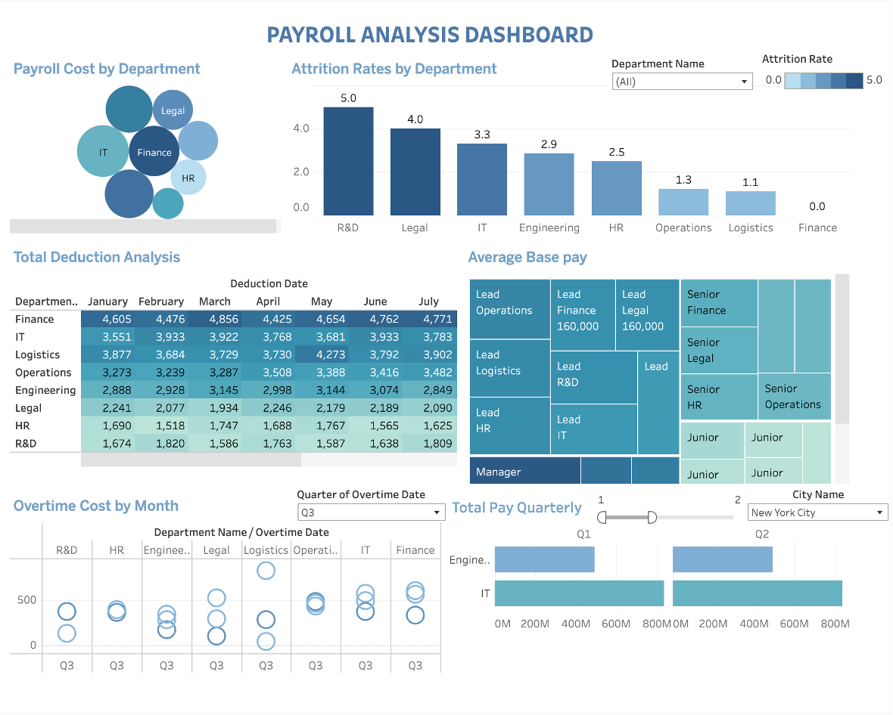

# Dashboard Guide

This guide explains the visualizations and insights available in our Payroll Analysis Dashboard.

## Dashboard Overview

The Payroll Analysis Dashboard provides a comprehensive view of compensation metrics, departmental costs, attrition rates, and overtime expenditure. It is designed to support data-driven decisions for HR and Finance stakeholders.

## Dashboard Components

### 1. Payroll Cost by Department

This bubble chart visualization shows the relative payroll costs across departments, with bubble size indicating total cost.

**Key Insights:**
- Finance, IT, and Legal departments represent the highest payroll costs
- HR department shows moderate payroll costs
- Operations has the lowest relative payroll expenditure

**Usage Tips:**
- Hover over bubbles to see exact payroll costs
- Compare relative sizes to understand departmental cost distribution

### 2. Attrition Rates by Department

This bar chart shows employee attrition rates across departments.

**Key Insights:**
- R&D has the highest attrition rate at 5.0%
- Legal follows at 4.0%
- IT (3.3%), Engineering (2.9%), and HR (2.5%) show moderate attrition
- Operations (1.3%) and Logistics (1.1%) show low attrition
- Finance shows 0.0% attrition, indicating excellent retention

**Usage Tips:**
- Compare departmental rates to company average
- Identify departments requiring retention initiatives

### 3. Total Deduction Analysis

This table shows monthly deductions by department from January through July.

**Key Insights:**
- Finance consistently has the highest monthly deductions
- Finance deductions peaked in March ($4,856) and July ($4,771)
- IT deductions show fluctuation, ranging from $3,551 to $3,933
- R&D consistently has the lowest deductions

**Usage Tips:**
- Look for monthly patterns and seasonality
- Compare departments to identify outliers

### 4. Average Base Pay

This heatmap visualization shows average base pay by position and department.

**Key Insights:**
- Lead positions in Operations, Finance, and Legal receive the highest base pay at $160,000
- Lead positions in Logistics, R&D, HR, and IT follow as the next compensation tier
- Senior positions in Finance, Legal, HR, and Operations form the middle tier
- Junior positions receive the lowest compensation

**Usage Tips:**
- Compare positions horizontally across departments
- Compare hierarchical levels vertically within departments

### 5. Overtime Cost by Month

This scatter plot shows overtime costs across departments for Q3.

**Key Insights:**
- IT and Finance departments show the highest overtime costs
- Legal department shows wide variance in overtime expenditure
- Engineering shows consistent moderate overtime costs
- HR shows the most controlled overtime expenses

**Usage Tips:**
- Look for clusters of points to identify departments with frequent overtime
- Identify outliers representing unusual overtime expenses

### 6. Total Pay Quarterly

This bar chart shows total compensation by department across quarters.

**Key Insights:**
- IT department shows significantly higher total pay in both Q1 and Q2
- Engineering shows moderate total pay across quarters
- Pay distribution is relatively consistent between Q1 and Q2

**Usage Tips:**
- Compare department totals within and across quarters
- Use the filter controls to analyze specific departments or locations

## Filters and Controls

The dashboard includes several interactive filters:

1. **Department Name**: Filter all visualizations by specific department
2. **Attrition Rate Slider**: Filter by attrition rate range
3. **Quarter of Overtime**: Focus overtime analysis on specific quarters
4. **City Name**: Filter data by location

## Recommended Analysis Flows

1. **Attrition Analysis**:
   - Start with Attrition Rates by Department
   - Compare to Average Base Pay for those departments
   - Check overtime costs for potential correlation with attrition

2. **Compensation Structure Analysis**:
   - Review Average Base Pay heatmap
   - Compare to Payroll Cost by Department
   - Analyze department sizes to understand cost efficiency

3. **Overtime Management**:
   - Examine Overtime Cost by Month
   - Compare to Total Deduction Analysis
   - Filter by specific departments of concern

4. **Geographical Analysis**:
   - Use the City Name filter to compare metrics across locations
   - Look for location-specific patterns in costs and attrition
