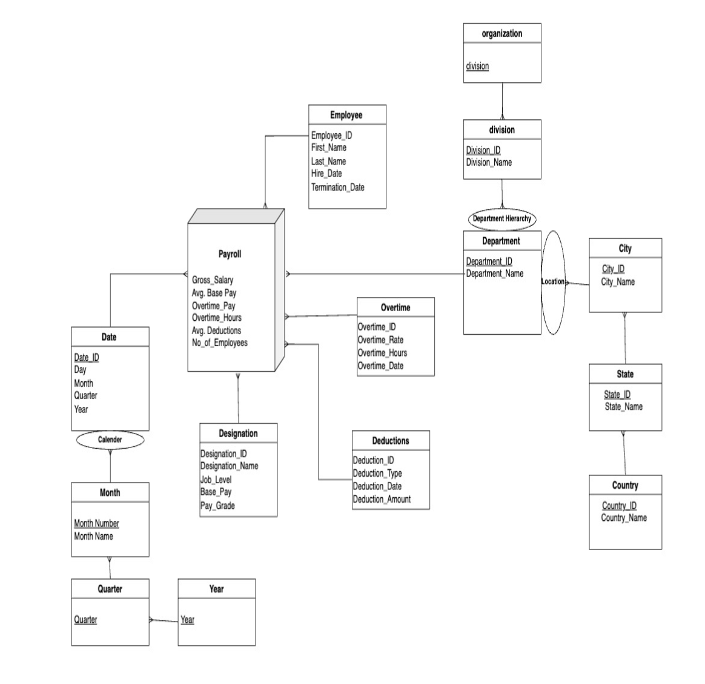

# Data Model Documentation

This document describes the dimensional data model implemented for our Payroll Management System Data Warehouse.

## Overview

Our data warehouse follows a star schema design optimized for analytical queries related to payroll management, employee compensation, and workforce analytics. The model consists of:

- 8 dimension tables providing contextual information
- 1 fact table containing quantitative measures

## Star Schema Diagram

The following diagram illustrates the relationships between our fact and dimension tables:

## Dimension Tables

### Employee Dimension
- **Primary Key**: employee_id
- **Attributes**: first_name, last_name, email, phone, date_of_birth, hire_date, termination_date
- **Description**: Contains employee demographic information and employment dates

### Department Dimension
- **Primary Key**: department_id
- **Attributes**: department_name, no_of_employees
- **Description**: Stores information about company departments and their size

### Designation Dimension
- **Primary Key**: designation_id
- **Attributes**: designation_name, job_level, job_grade
- **Description**: Contains job titles, roles, and their hierarchical position

### Branch Dimension
- **Primary Key**: branch_id
- **Attributes**: branch_name, branch_city, branch_state
- **Description**: Stores information about company locations and offices

### Date Dimension
- **Primary Key**: date_id
- **Attributes**: date, month, year, quarter, day_of_month, day_of_week, is_weekend
- **Description**: Calendar information for time-based analysis

### Deductions Dimension
- **Primary Key**: deduction_id
- **Attributes**: employee_id, deduction_type, deduction_date, deduction_amount
- **Description**: Information about payroll deductions by type and amount

### Overtime Dimension
- **Primary Key**: overtime_id
- **Attributes**: employee_id, overtime_date, overtime_hours, overtime_rate
- **Description**: Details about overtime worked including hours and compensation rate

### State and City Dimensions
- **Primary Keys**: state_id, city_id
- **Attributes**: state_name, city_name, country
- **Description**: Geographic hierarchy for location-based analysis

## Fact Table

### Payroll Fact Table
- **Primary Key**: payroll_id
- **Foreign Keys**: employee_id, department_id, designation_id, branch_id, date_id, overtime_id, deduction_id
- **Measures**:
  - base_pay: Base salary amount
  - overtime_cost: Calculated as overtime_hours * overtime_rate
  - deduction_amount: Total deductions
  - net_pay: Calculated as base_pay + overtime_cost - deduction_amount

## Additional Calculated Measures

As documented in our project, we implemented these additional calculated measures:

1. **Average Base Pay**: Calculated by averaging the base pay from the Payroll table in the source system
2. **Average Deductions**: Calculated by averaging the deductions from the Payroll table in the source system
3. **Overtime Cost Formula**: calculated using the formula `overtime_hours * overtime_rate`
4. **Net Pay Formula**: calculated using the formula `base_pay + (overtime_hours * overtime_rate) - deduction_amount`

## Data Types and Constraints

- All monetary amounts use DECIMAL data type for precision
- Date fields use standardized DATE format
- Text fields use VARCHAR with appropriate length limits
- Foreign key constraints ensure referential integrity
- NOT NULL constraints on critical fields ensure data quality

## Indexing Strategy

- Primary keys are indexed by default
- Foreign keys are indexed to improve join performance
- Additional indexes on frequently queried fields (date, department)

## SCD (Slowly Changing Dimension) Strategy

- Employee dimension: Type 2 SCD with effective dates
- Department dimension: Type 1 SCD (overwrites old values)
- Designation dimension: Type 2 SCD with effective dates
- Other dimensions: Type 1 SCD
